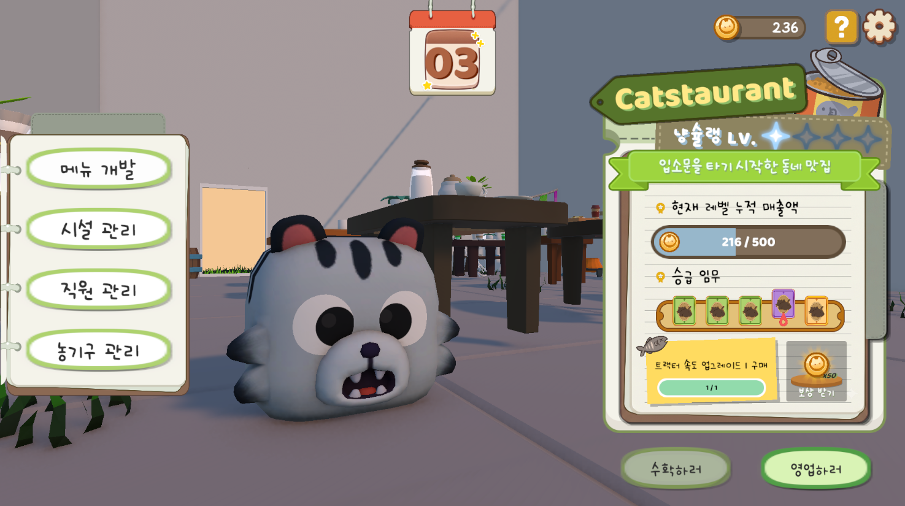
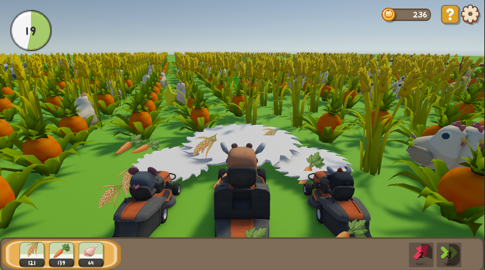
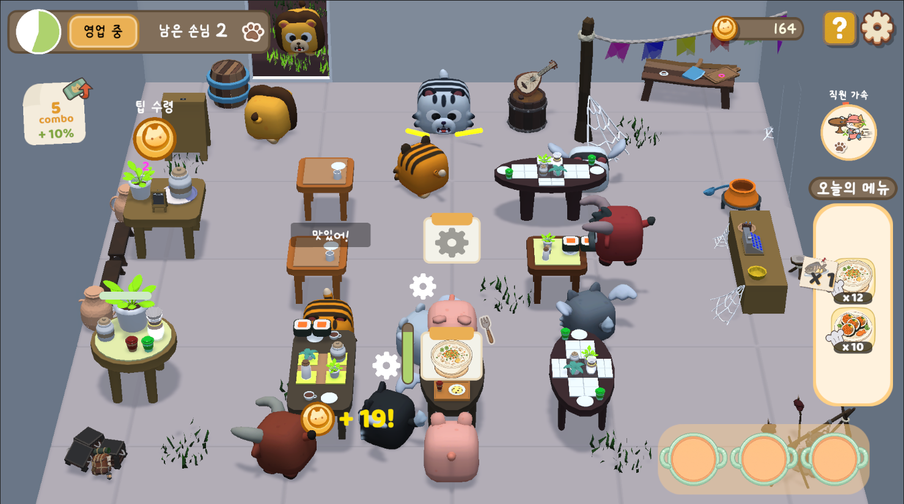
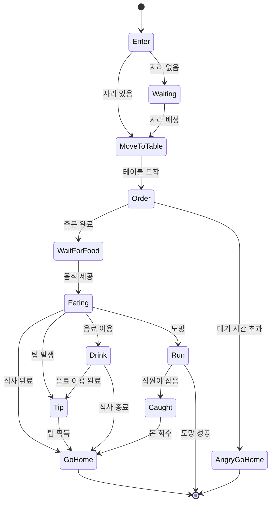
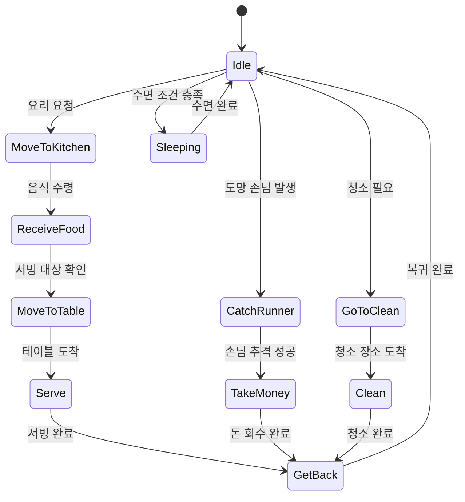

<!-- HERO (centered only at the top) -->
<h1 align="center">Harvest Restaurant</h1>
<p align="center"><em>하이퍼 캐주얼 타이쿤 게임</em></p>


<p align="center">
  <a href="https://www.youtube.com/watch?v=g8p18phqylE">
    
  </a>
</p>

<table>
  <tr>
    <td></td>
    <td></td>
    <td></td>
  </tr>
</table>

---
## About the Game

**Harvest Restaurant**는 **붕괴: 스타레일의 황금 미궁 레스토랑**과 **White Out Surviber**을 참고하여 제작한 하이퍼 캐주얼 타이쿤 게임입니다.

플레이어는 하루동안 작물수확과 식당운영을 번갈아 진행합니다. 수확한 작물로 만든 요리를 판매해 재화를 획득하고, 재화를 통해 능력을 업그레이드해 성장합니다.  
세션을 반복하며 새로운 작물과 더 많은 손님을 해금하고, 업그레이드를 통해 수확과 식당 운영의 효율을 높여 성장하는 것이 목표입니다.

## Features

- **세션 시스템**: 정해진 시간 동안 수확, 운영을 진행하고 결과 화면에서 획득 자원을 확인 및 메인 화면에서 각종 업그레이드 진행
- **WASD 기반 수확**: 키보드 이동을 통해 수확 진행
- **트랙터 강화**: 나무, 구리, 철, 금, 다이아, 전설 곡괭이로 성장하며 채굴 능력 증가
- **수확 시스템**: 트랙터를 운전해 다양한 작물과 자원 획득
- **상태 시스템**: 손님과 직원의 다양한 상태 구현 (주문, 서빙, 식사, 도망, 팁 등)
- **길찾기 시스템**: 식당 운영에서 손님과 직원의 경로 찾기 구현
- **직원 자동화 시스템**: 서빙, 요리 등 직원이 스스로 판단해 업무를 처리하는 기능 구현
- **가구 시스템**: 테이블, 팁테이블, 드링크바 등 추가 수입원 구현
- **업그레이드 시스템**: 수확 환경, 수확 기능, 식당, 식당 가구, 직원, 요리 등 다양한 업그레이드 구현
- **토스트 메시지 시스템**: 제한 사항이나 요구 사항을 플레이어에게 알리는 토스트 메시지 구현
- **저장 시스템**: 보유 자원, 업그레이드 레벨, 게임 진행도, 오디오 설정 저장
- **사운드/연출 피드백**: 각 상황에 맞는 효과음, 배경음악 삽입, DOTween을 활용한 화면전환 애니메이션 및 VFX 삽입
## Progression

- **트랙터 강화**: 재화를 소모해 톱날 크기, 속도, 트랙터 속도 등을 강화해 수확 효율 증가
- **농장 개방**: 재화를 소모해 더 가격이 높은 요리의 재료가 되는 작물이 있는 농장 개방
- **농장 직원 고용**: 수확 시 측면에서 추가 수확을 진행하고 추가 효과를 제공하는 농장 직원 고용 및 업그레이드
- **식당 레벨업**: 특정 임무 수행 시 식당 레벨업 가능, 식당 레벨에 따른 추가 업그레이드 해금 및 보상 제공
- **식당 가구 추가**: 식당에 가구를 추가하고 업그레이드 해 손님 수 증가 및 팁 제공 등 추가 효과 제공
- **식당 직원 고용**: 식당 직원을 추가로 고용해 더 높은 효율의 서빙, 요리 및 자동화 등 추가 효과 제공
- **요리 개발**: 더 높은 가격의 요리 개발 및 판매요리 선택
- **게임 루프**: 메인 → 작물 수확 → 메인 → 식당 운영 → 메인 → 다음날 / 메인에서 업그레이드 후 더 높은 효율의 세션 반복 

## Project Structure

```text
Assets/Scripts
├── Audios          # 배경음악, 효과음 데이터 관리
├── Datas           # 수확, 음식, 가구, 직원, 저장 데이터 ScriptableObject/DTO
├── DBs             # Resources 데이터 로드용 DB 클래스
├── Harvest         # 수확, 트랙터, 직원, 농장 등 수확 시스템
├── Managers        # 게임, 저장, 오디오, 수확, 운영, 업그레이드, 스킬 매니저
├── Markets         # 레벨 별 구매 항목 관리 시스템
├── Scenes          # Main/Upgrade/GameLoop 씬 전환 로직
├── Service         # 길찾기, 손님, 직원, 가구 등 식당 운영 시스템
├── UIs             # 메인 UI, 게임 루프 UI, 수확 UI, 운영UI, 업그레이드 UI
├── UpgradeSys      # 런타임 스탯, 레벨 및 업그레이드 시스템
└── Utility         # CSV Reader
```
## 손님 상태 흐름도

## 직원 상태 흐름도

